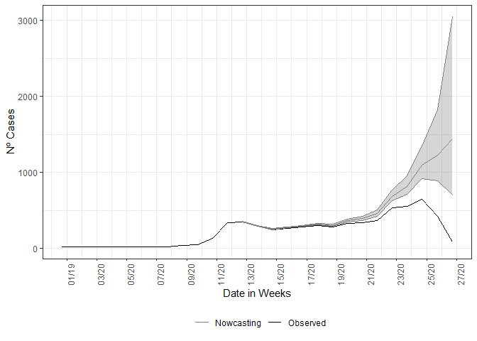
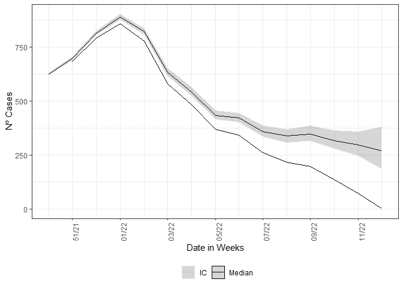
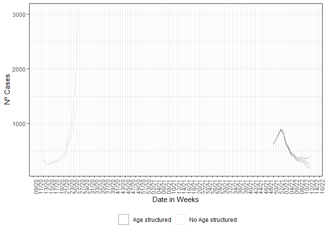

# nowcaster <a href='https://github.com/covid19br/nowcaster'></a> <a href='https://github.com/covid19br/nowcaster'></a>

`nowcaster` is a R package for “nowcasting” epidemiological time-series.
Every single system of notification has an intrinsic delay, `nowcaster`
can estimate how many counts of any epidemiological data of interest
(*i.e.*, daily cases and deaths counts) by fitting a negative binomial
model to the time steps of delay between onset date of the event,
(*i.e.*, date of first symptoms for cases or date of occurrence of
death) and the date of report (*i.e.*, date of notification of the case
or death).

`nowcaster` is based on the
[`R-INLA`](https://becarioprecario.bitbucket.io/inla-gitbook/index.html)
and
[`INLA`](https://inla.r-inla-download.org/r-inla.org/doc/inla-manual/inla-manual.pdf)
packages for “**I**ntegrated **N**ested **L**aplace **A**pproximation”
algorithm to Bayesian inference. `INLA` is a fast alternative to others
methods for Bayesian inference like **MCMC**. An introduction to `INLA`
can be found
[here](https://becarioprecario.bitbucket.io/inla-gitbook/index.html).

`nowcaster` is build for epidemiological emergency use, it was
constructed for the Brazilian Severe Acute Respiratory Illness (SARI)
surveillance database (SIVEP-Gripe).

## Installing

To install `nowcaster` package simply run the code below in R:

``` r
if( !require(nowcaster, quietly = T) ){
  devtools::install_github("https://github.com/covid19br/nowcaster")
}
```

After installing you can load the by typical library:

``` r
library(nowcaster)
```

## First example on LazyData

When the package is loaded it disponibilize a LazyData file, `sariBH`,
it is a annonymized records of Severe Acute Respiratory Illness notified
in the city of Belo Horizonte, since March 2020 to April 2022. To load
it basically write:

``` r
# Loading Belo Horizonte SARI dataset
data(sragBH)
```

And we take a look on the data:

``` r
head(sragBH)
```

    ##   DT_SIN_PRI  DT_DIGITA CLASSI_FIN EVOLUCAO CO_MUN_RES Idade fx_etaria
    ## 1 2020-02-11 2020-03-05          4        1     310620    59   50 - 59
    ## 2 2020-01-21 2020-02-06          4        1     310620    79   70 - 79
    ## 3 2020-03-30 2020-04-17          4        1     310620    72   70 - 79
    ## 4 2020-03-26 2020-04-02          4        1     310620    82      80 +
    ## 5 2020-03-20 2020-04-13          4        1     310620    50   50 - 59
    ## 6 2020-04-07 2020-04-22          5        1     310620    74   70 - 79

It is a data.frame with 7 variables and 65,404 observations. We will
make use of only the first two columns, “DT_SIN_PRI” (date of onset
symptoms) and “DT_DIGITA” (recording date) as well the column “Idade”
(age in years) to make age structured nowcasting.

## Non-structured data

Now we call the nowcasting function, it has by default the
parametrization to take the data and estimate with a non-structured data
form. The estimate fits a negative binomial distribution,
*N**e**g**B**i**n**o**m*(*λ*<sub>*t*, *d*</sub>,*ϕ*), to the cases count
at time *t* with delay *d*, *ϕ* is the dispersion parameter. The rate
*λ*<sub>*t*, *d*</sub> is then parameterized in a log-linear format by a
constant term added by structured delay random effects and structured
time random effects. Hence, the model is given by the following:

$$\\begin{equation}
Y\_{t,d} \\sim NegBinom(\\lambda\_{t,d}, \\phi), \\\\
\\log(\\lambda\_{t,d}) = \\alpha + \\beta_t + \\gamma_d, \\\\
t=1,2,\\ldots,T, \\\\ d=1,2,\\ldots,D,
\\end{equation}$$

where the intercept *α* follows is Gaussian distribution with a very
large variance, *β*<sub>*t*</sub> is follows a second order random walk
with precision *τ*<sub>*β*</sub>, *γ*<sub>*d*</sub> a first-order random
walk with precision *τ*<sub>*γ*</sub>. The model is then completed by
INLA default prior distributions for *ϕ*, *τ*<sub>*β*</sub>, and
*τ*<sub>*γ*</sub>. See nbinom, rw1 and rw2 INLA help pages.

The call of the function is straightforward, it simply needs a dataset
as input, here the `LazyData` loaded in the namespace of the package.
The function has 3 mandatory parameters, `dataset` for the parsing of
the dataset to be nowcasted, `date_onset` for parsing the column name
which is the date of onset of symptoms and `date_report` which parses
the column name for the date of report of the cases. Here this columns
are “DT_SIN_PRI” and “DT_DIGITA”, respectively.

``` r
nowcasting_bh_no_age <- nowcasting_inla(dataset = sragBH, 
                                        date_onset = DT_SIN_PRI, 
                                        date_report = DT_DIGITA)
head(nowcasting_bh_no_age$total)
```

    ## # A tibble: 6 × 7
    ##    Time dt_event   Median    LI    LS   LIb   LSb
    ##   <int> <date>      <dbl> <dbl> <dbl> <dbl> <dbl>
    ## 1    17 2021-12-13   625    621  632.   623   627
    ## 2    18 2021-12-20   695    687  707    692   698
    ## 3    19 2021-12-27   812    800  830    808   818
    ## 4    20 2022-01-03   886.   870  908    880   893
    ## 5    21 2022-01-10   819    798  846    811   826
    ## 6    22 2022-01-17   631    610  662    623   640

This calling will return only the nowcasting estimate and its Confidence
Interval (CI) for two different Credible interval, `LIb` and `LSb` are
the max and min CI, respectively, with credibility of 50% and `LI` and
`LS` are the max and min CI, respectively, with credibility of 95%.

`nowcasting_inla` has the option to return the curve for when the
nowcasting estimate was set the window of action of the model, if the
`data.by.week` parameter is flagged as `TRUE` it returns on the second
element of the output list the summarized data by week.

``` r
nowcasting_bh_no_age <- nowcasting_inla(dataset = sragBH, 
                                        date_onset = DT_SIN_PRI, 
                                        date_report = DT_DIGITA, 
                                        data.by.week = T)
head(nowcasting_bh_no_age$dados)
```

    ## # A tibble: 6 × 3
    ##   date_report date_onset Delay
    ##   <date>      <date>     <dbl>
    ## 1 2021-01-04  2020-12-28     1
    ## 2 2021-01-11  2021-01-04     1
    ## 3 2021-01-11  2020-12-28     2
    ## 4 2021-01-11  2021-01-04     1
    ## 5 2021-01-11  2020-12-28     2
    ## 6 2021-01-18  2021-01-04     2

This element it is the counts of cases by the amount of delay. It is
known as the delay triangle, if we table the delay amount against the
data of onset of first symptoms, it can see how is the pattern of the
delay for the cases.

``` r
data_triangle <- nowcasting_bh_no_age$dados |> 
  filter(Delay < 30) |> 
  arrange(desc(Delay))
delay_triangle<-table(data_triangle$date_onset, 
                      rev(data_triangle$Delay),
                      dnn = list("Date of Onset", "Delay"))
head(delay_triangle)
```

    ##              Delay
    ## Date of Onset   0   1   2   3   4   5   6   7   8   9  10  11  12  13  14  15
    ##    2020-12-28  32 134 169 124  87  65  39  45  30  25  27  18   0   0   2   5
    ##    2021-01-04  20 126 154  96 110  70  39  49  29  17  17  15   0   0   2   4
    ##    2021-01-11  30 103 138 106  67  46  47  47  36  29  22   9   0   0   0   4
    ##    2021-01-18  15  77  95  74  60  42  28  22  20  27  12  12   0   0   1   7
    ##    2021-01-25  16 108 109  92  75  44  44  45  26  31  15  16   0   0   0   9
    ##    2021-02-01  20  99  86  82  66  41  23  41  27  16  15  13   0   0   1   4
    ##              Delay
    ## Date of Onset  16  17  18  19  20  21  22  23  24  25  26  27  28  29
    ##    2020-12-28   0   6   3   0   1   2   1   0   0   0   0   0   0   0
    ##    2021-01-04   9   2   1   1   2   2   2   0   0   0   0   0   0   0
    ##    2021-01-11   7   3   3   1   1   2   1   0   0   0   0   0   0   0
    ##    2021-01-18   8   5   4   2   3   2   2   0   0   0   0   0   0   0
    ##    2021-01-25   3   6   2   2   1   3   2   0   0   0   0   0   0   0
    ##    2021-02-01   5   6   4   2   4   1   0   0   0   0   0   0   0   0

We just look at the amount of cases with 30 weeks of delay or less, it
is the default maximum delay considered at nowcasting estimation.

If this element is groped by and summarized by the onset of symptoms
date, here `DT_SIN_PRI`, it is the epidemiological curve observed. To
example it, we plot the estimate and the epidemiological curve all
together.

``` r
library(ggplot2)

dados_by_week <- nowcasting_bh_no_age$dados %>% 
  filter(date_onset >= (Sys.Date()-270)) %>% 
  group_by(date_onset) %>% 
  summarise(n = n())


nowcasting_bh_no_age$total %>% 
  ggplot(aes(x = dt_event, y = Median, col = 'Nowcasting')) +
  geom_line(data = dados_by_week, aes(date_onset, y = n, col = 'Observed'))+
  geom_ribbon(aes(ymin = LI, ymax = LS, col = NA), alpha = 0.2, show.legend = F)+
  geom_line()+
  theme_bw()+
  theme(legend.position = "bottom", axis.text.x = element_text(angle = 90)) +
  scale_color_manual(values = c('grey50', 'black'), name = '')+
  scale_x_date(date_breaks = '2 weeks', date_labels = '%V/%y', name = 'Date in Weeks')+
  labs(x = '', y = 'Nº Cases')
```

<!-- -->

## Structured data, Age

For the structured data the `nowcasting_inla()` fits again a Negative
binomial distribution to the cases count at time *t* with delay *d*.
Differently, from the non-structured case the model now gives random
effects to the delay distribution and and time distribution by each of
the age-class chosen by the user to break the data. The model has the
form now:

$$\\begin{equation}Y\_{t,d,a} \\sim  NegBinom(\\lambda\_{t,d,a}, \\phi), \\\\
\\log(\\lambda\_{t,d,a}) =  \\alpha_a + \\beta\_{t,a} + \\gamma\_{d,a}, \\\\ \\quad t=1,2,\\ldots,T, \\\\ d=1,2,\\ldots,D, \\\\ a=1,2,\\ldots,A, \\end{equation}$$

where each age class, *a*, has an intercept *α*<sub>*a*</sub> following
a Gaussian distribution with a very large variance, the time-age random
effects, *β*<sub>*t*, *a*</sub>, follow a joint multivariate Gaussian
distribution with a separable variance components an independent
Gaussian term for the age classes with precision
*τ*<sub>*a**g**e*, *β*</sub> and a second order random walk term for the
time with precision *τ*<sub>*β*</sub>. Analogously, the delay-age random
effects, *γ*<sub>*d*, *a*</sub>, follow a joint multivariate Gaussian
distribution with a separable variance components an independent
Gaussian term for the age classes with precision
*τ*<sub>*a**g**e*, *γ*</sub> and a first order random walk term for the
time with precision *τ*<sub>*γ*</sub>. The model is then completed by
INLA default prior distributions for *ϕ*, *τ*<sub>*a**g**e*, *β*</sub>,
*τ*<sub>*a**g**e*, *γ*</sub>, *τ*<sub>*β*</sub> and *τ*<sub>*γ*</sub>.
See nbinom, iid, rw1 and rw2 INLA help pages.

This new model corrects the delay taking into account the effects of age
classes and the interactions of each age class between time and also
delay. Now the model needs a flag indicating which is the column on the
dataset which will be used to break the data into age classes and how
the age classes will be split. This is given by the parameters `age_col`
and `bins_age`. We pass three additional parameters, `data.by.week` to
return the epidemiological curve out of window of action of nowcasting
estimate and `return.age` to inform we desire a nowcasting result in two
ways, the total aggregation estimate and the age-stratified estimate.
The calling of the function has the following form:

``` r
nowcasting_bh_age <- nowcasting_inla(dataset = sragBH, 
                                   bins_age = "10 years",
                                   data.by.week = T, 
                                   date_onset = DT_SIN_PRI, 
                                   date_report = DT_DIGITA,
                                   age_col = Idade)
```

Each of the estimates returned by `nowcasting_inla` has the same form as
in the non-structured case. On the nowcasting estimates, it returns a
data.frame with the posterior edian and 50% and 95% credible intervals,
(LIb and LSb) and (LI and LS) respectively.

``` r
library(ggplot2)

dados_by_week <- nowcasting_bh_age$dados %>% 
  filter(date_onset >= (Sys.Date()-270)) %>% 
  group_by(date_onset) %>% 
  summarise(n = n())


nowcasting_bh_age$total %>% 
  ggplot(aes(x = dt_event, y = Median, col = 'Median'))+
  geom_line()+
  geom_line(data = dados_by_week, aes(date_onset, y = n))+
  geom_ribbon(aes(ymin = LI, ymax = LS, col = 'IC'), alpha = 0.2)+
  theme_bw()+
  theme(legend.position = "bottom", axis.text.x = element_text(angle = 90))+
  scale_color_manual(values = c('grey90', 'black'), name = '')+
  scale_x_date(date_breaks = '2 weeks', date_labels = '%V/%y', name = 'Date in Weeks')+
  labs(x = '', y = 'Nº Cases')
```

<!-- -->

## Comparing the estimates

We can compare the estimates by each of the strategies, we plot the two
estimates together:

``` r
nowcasting_bh_no_age$total$type <- "No Age structured"
nowcasting_bh_age$total$type <- "Age structured"


nowcasting_bh_total <- nowcasting_bh_age$total %>% 
  full_join(nowcasting_bh_no_age$total)

nowcasting_bh_total %>% 
  ggplot(aes(x = dt_event, y = Median, col = type))+
  geom_line(show.legend = F)+
  geom_ribbon(aes(ymin = LI, ymax = LS, fill = NULL), alpha = 0,
              show.legend = T)+
  theme_bw()+
  theme(legend.position = "bottom", axis.text.x = element_text(angle = 90))+
  scale_color_manual(values = c('grey60', 'grey90'), name = '')+
  scale_fill_manual(values = c('grey60', 'grey90'), name = '')+
  scale_x_date(date_breaks = '2 weeks', date_labels = '%V/%y', name = 'Date in Weeks')+
  labs(x = '', y = 'Nº Cases')
```

<!-- -->

The estimates gives different CIs, this is due to a better fitting when
considering random effects by age class for the delays at time, this has
to do with the different capability to respond on different ages. This
is an empirical finding of this models.

``` r
sessionInfo()
```

    ## R version 4.1.3 (2022-03-10)
    ## Platform: x86_64-pc-linux-gnu (64-bit)
    ## Running under: Manjaro Linux
    ## 
    ## Matrix products: default
    ## BLAS:   /usr/lib/libblas.so.3.10.0
    ## LAPACK: /usr/lib/liblapack.so.3.10.0
    ## 
    ## locale:
    ##  [1] LC_CTYPE=en_US.UTF-8       LC_NUMERIC=C              
    ##  [3] LC_TIME=en_US.UTF-8        LC_COLLATE=en_US.UTF-8    
    ##  [5] LC_MONETARY=en_US.UTF-8    LC_MESSAGES=en_US.UTF-8   
    ##  [7] LC_PAPER=en_US.UTF-8       LC_NAME=C                 
    ##  [9] LC_ADDRESS=C               LC_TELEPHONE=C            
    ## [11] LC_MEASUREMENT=en_US.UTF-8 LC_IDENTIFICATION=C       
    ## 
    ## attached base packages:
    ## [1] parallel  stats     graphics  grDevices utils     datasets  methods  
    ## [8] base     
    ## 
    ## other attached packages:
    ##  [1] INLA_22.04.06        sp_1.4-6             foreach_1.5.2       
    ##  [4] Matrix_1.4-0         lubridate_1.8.0      forcats_0.5.1       
    ##  [7] stringr_1.4.0        dplyr_1.0.9          purrr_0.3.4         
    ## [10] readr_2.1.2          tidyr_1.2.0          tibble_3.1.7        
    ## [13] ggplot2_3.3.5        tidyverse_1.3.1      nowcaster_0.1.0.9000
    ## 
    ## loaded via a namespace (and not attached):
    ##  [1] Rcpp_1.0.8          lattice_0.20-45     assertthat_0.2.1   
    ##  [4] digest_0.6.29       utf8_1.2.2          R6_2.5.1           
    ##  [7] cellranger_1.1.0    MatrixModels_0.5-0  backports_1.4.1    
    ## [10] stats4_4.1.3        reprex_2.0.1        evaluate_0.15      
    ## [13] highr_0.9           httr_1.4.2          pillar_1.7.0       
    ## [16] rlang_1.0.2         readxl_1.3.1        rstudioapi_0.13    
    ## [19] rmarkdown_2.11      labeling_0.4.2      splines_4.1.3      
    ## [22] munsell_0.5.0       broom_0.7.12        numDeriv_2016.8-1.1
    ## [25] compiler_4.1.3      modelr_0.1.8        xfun_0.29          
    ## [28] pkgconfig_2.0.3     mnormt_2.0.2        tmvnsim_1.0-2      
    ## [31] htmltools_0.5.2     tidyselect_1.1.2    codetools_0.2-18   
    ## [34] fansi_1.0.3         crayon_1.5.1        tzdb_0.2.0         
    ## [37] dbplyr_2.1.1        withr_2.5.0         grid_4.1.3         
    ## [40] jsonlite_1.7.3      gtable_0.3.0        lifecycle_1.0.1    
    ## [43] DBI_1.1.2           magrittr_2.0.3      scales_1.1.1       
    ## [46] cli_3.3.0           stringi_1.7.6       farver_2.1.0       
    ## [49] sn_2.0.1            fs_1.5.2            xml2_1.3.3         
    ## [52] ellipsis_0.3.2      generics_0.1.2      vctrs_0.4.1        
    ## [55] iterators_1.0.14    tools_4.1.3         glue_1.6.2         
    ## [58] hms_1.1.1           fastmap_1.1.0       yaml_2.3.4         
    ## [61] colorspace_2.0-3    rvest_1.0.2         knitr_1.37         
    ## [64] haven_2.4.3
